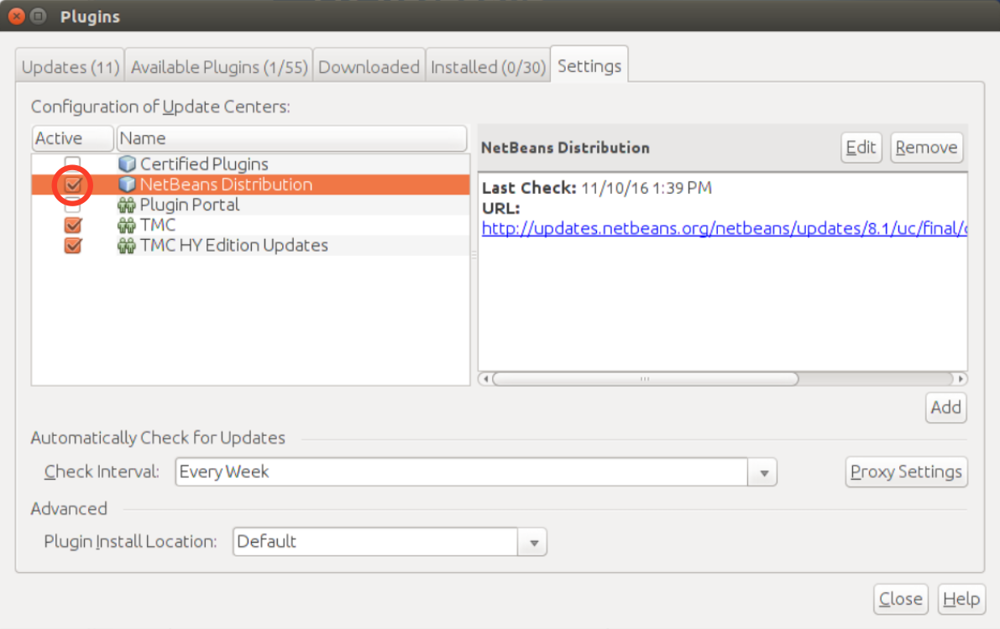
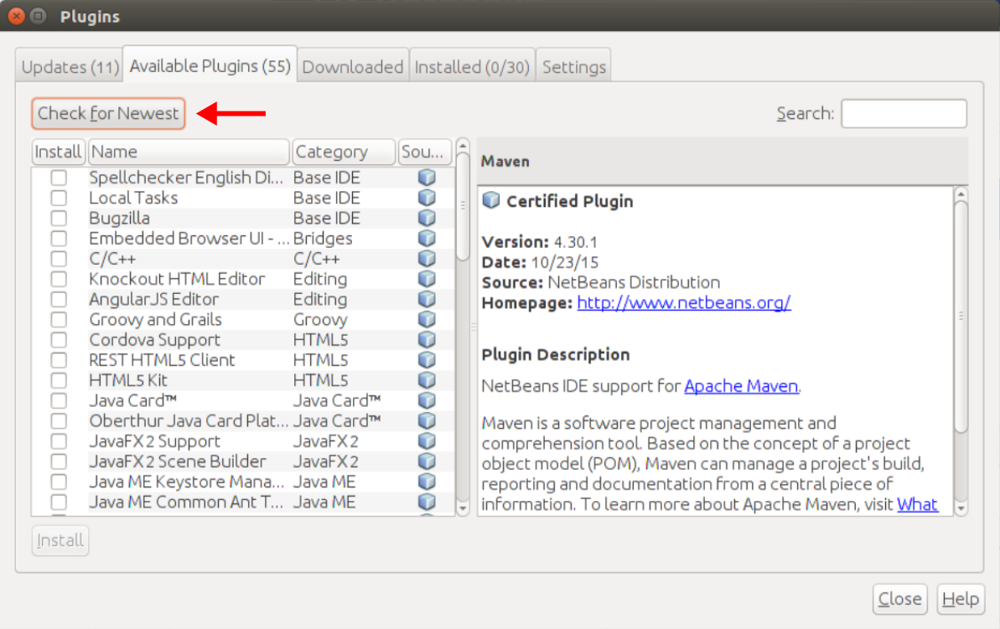
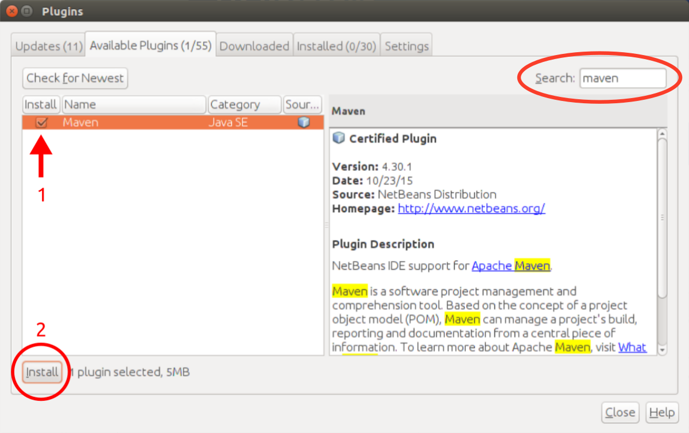
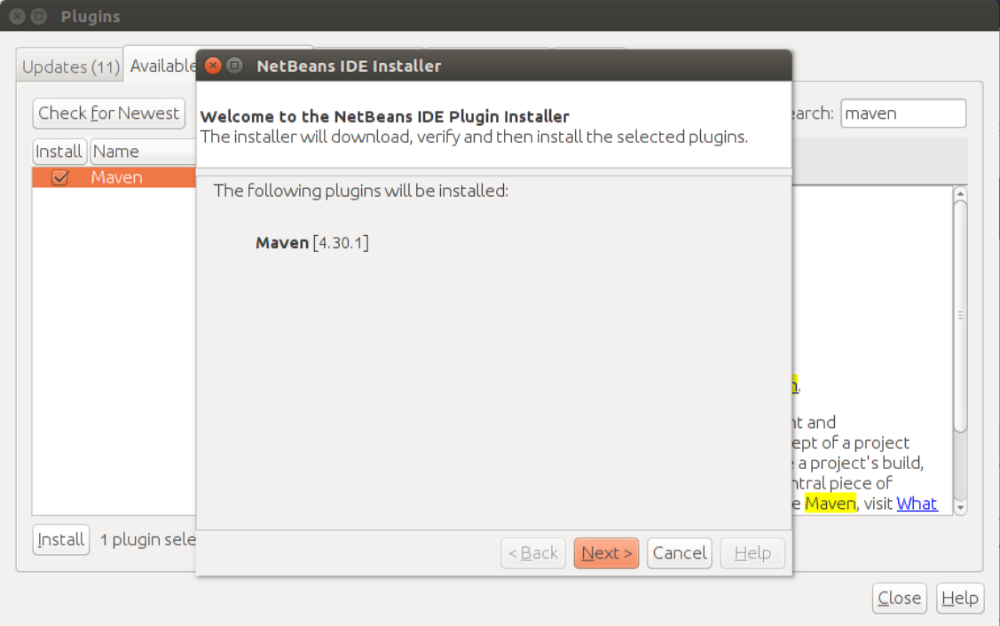

# Fixing Maven in Netbeans

Some distributions of NetBeans have been stripped of Maven support. This is problematic, as it breaks dowloading and opening Manven exercises with the TestMyCode plugin. The issue seems to affect at least the default NetBeans in Ubuntu 16.04 repositories.

This document describes a way to fix the issue by installing Maven support in NetBeans.

## Instructions

Open Netbeans and open the `Plugins` dialog by selecting `Tools` > `Plugins`.

Next, navigate to the `Settings` tab and make sure `NetBeans Distribution` is selected.

Then navigate to the `Available Plugins` tab, and click `Check for Newest`.

Select Maven from the list and click install. Using the search bar may help with finding the entry.

Then proceed with the installation. Once it's completed and NetBeans has restarted, downloading maven exercises should work again.

